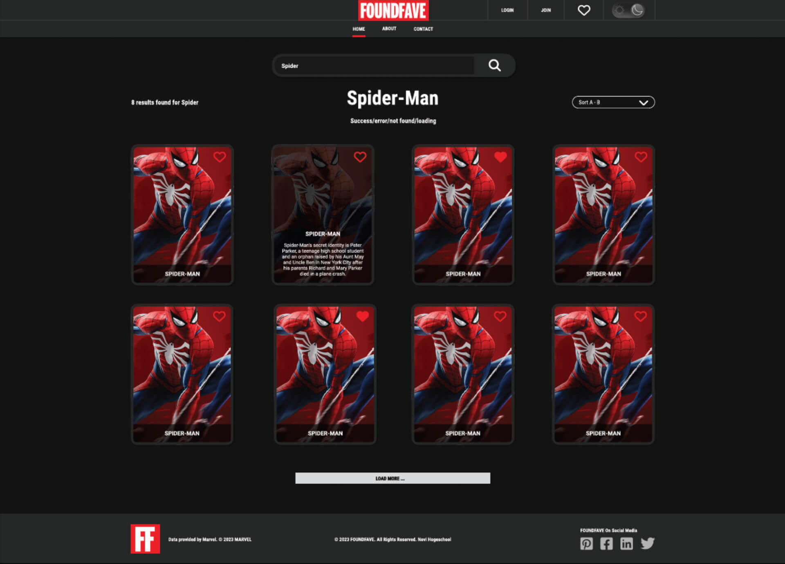

Datum laatste update: 20-5-2023

[](https://app.netlify.com/sites/foundfave/deploys)

# FOUNDFAVE App - Eindopdracht Frontend NOVI Hogeschool

## Inhoudsopgave
1. [Screenshot van de FOUNDFAVE app](#screenshot-van-de-foundfave-app)
1. [Live demo](#live-demo)
1. [Aan de examinator](#aan-de-examinator)
1. [Environment variables](#environment-variables)
1. [Inleiding](#inleiding)
1. [Benodigdheden](#benodigdheden)
1. [Installatie](#installatie)
1. [De applicatie draaien](#de-applicatie-draaien)
1. [Overige commando's](#overige-commandos)
1. [Contact](#contact)

## Screenshot van de FOUNDFAVE app


## Live demo
Een live demo van deze app is te vinden op: <a target="_blank" href="https://foundfave.online">FOUNDFAVE App Demo</a>


## Aan de examinator
Beste examinator,

Met trots presenteer ik mijn React app voor de frontend eindopdracht.

__Opmerkingen__

Bijgesloten in de root een .env.dist bestand met daarin de namen van de variabelen.

In het .env.dist bestand staan de volgende variabelen. 

__Marvel API public key__: 
`4780bcc0dddcf771e505b68197ce5f56`

De environment variabelen op de volgende manier instellen: 
* VITE_APP_BASE_URL=
* VITE_APP_PUBLIC_KEY=

Daarna een .env bestand aanmaken, deze in de root plaatsen en daarna bovenstaande variabelen in het bestand plaatsen.

## Environment variables
De environment variables zijn in de live demo geïntegreerd met de hosting van Netlify en zijn de API keys niet zichtbaar voor het publiek.


React H8.6:
> Wanneer je dit doet voor jouw eigen projecten, voeg je in de README.md een begeleidende tekst toe waarin je de gebruiker instrueert een eigen .env bestand aan te maken en deze te vullen met de variabel-namen zoals beschreven in env.dist. Uiteraard benoem je ook het maken van een build, en waar de gebruiker aan deze variabelen kan komen.


## Inleiding
Zit je steeds met het handen in je haar als je jouw favoriete Marvel karakters steeds in een Word document moet copy-pasten om ze te bewaren? Treur niet langer! Met deze app kun je jouw Marvel karakters online bewaren in deze handige app. 

FOUNDFAVE is dé online app om Marvel karakters op te zoeken en te bewaren. 


## Benodigdheden
Welke software heb je nodig om deze app te draaien?

De volgende software en tools:
* [NodeJS](https://nodejs.org/en)
* Een terminal, zoals:
  * [HyperJS](https://hyper.is)
  * [Git Bash](https://git-scm.com/downloads)
* Code editors/IDE's, zoals:
  * [Visual Studio Code](https://code.visualstudio.com)
  * [WebStorm](https://www.jetbrains.com/webstorm/) of een andere equivalente editor, zoals Sublime Text, Brackets, etc.


## Installatie
Deze app maakt gebruikt van [ViteJS](https://vitejs.dev) in plaats van [Create-React-App](https://create-react-app.dev). Ik heb hier bewust voor gekozen omdat Vite prettiger en sneller werkt en is lichter qua bestandsgrootte. 

NodeJS installeren. [NodeJS](https://nodejs.org/en)

__Het Github FOUNDFAVE app project clonen__
```bash
git clone git@github.com:Aphelion-im/FOUNDFAVE-frontend-eindopdracht-react.git
```
__NPM Dependecies installeren__
```bash
npm install
```


## Installatie van de <...> App

In de Als je het project gecloned hebt naar jouw locale machine, installeer je eerst de node_modules door het volgende commando in de terminal te runnen:

* npm  install

Wanneer dit klaar is, kun je de applicatie starten met behulp van:
* npm run dev, server adres, CTRL + C om live server te stoppen

... of gebruik de WebStorm knop (npm start). Open http://localhost:3000 om de pagina in de browser te bekijken.


## De applicatie draaien

Een ViteJS React project live server opstarten
```bash
npm run dev
```
De live server zal nu opstarten op adres:
http://localhost:5173 

CTRL + C om de live server te stoppen.


## Overige commando's


## Contact
Mocht je nog vragen of opmerkingen hebben, stuur dan gerust een mail naar: andre.de.groot@novi-education.nl of stuur een bericht via Teams.

Met vriendelijke groet,

André de Groot


## Environment Variabeles
Environment variables zijn variabelen die we declareren in een .env bestand. Omdat we dit bestand nooit mee pushen naar GitHub (en dus altijd even handmatig moeten toevoegen aan de .gitignore!) blijven onze tokens geheim. Waarschijnlijk denk je nu: maar als we met anderen samenwerken aan een project, hebben zij de geheime token toch ook nodig? En dat klopt ook. Daarom maak je ook altijd een .env.dist (of .env.example) file aan die je wél meepusht naar GitHub. Daarin zet je de namen van de variabelen, maar zonder waardes. Het is dan voor de volgende developer duidelijk welke tokens ze nodig hebben om het project te laten werken. In de README.md benoem je altijd hoe men aan deze waardes kan komen (even een collega of baas vragen) - of in ons geval: dat ze zelf een API key aan moeten maken bij OpenWeather.

__Let op__: voor jouw eindproject deel je altijd jouw eigen API keys in de installatiehandleiding, zodat de examinator niet zelf een key hoeft aan te maken.

Voorbeeld vaneen installatiehandleiding:
* https://github.com/hogeschoolnovi/frontend-react-private-blog
* https://github.com/hogeschoolnovi/frontend-react-pokemon