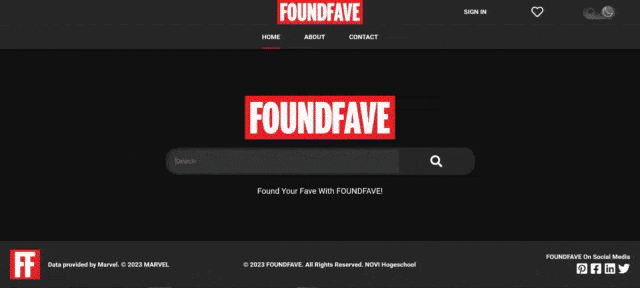

Datum laatste update: 8-3-2024

[](https://app.netlify.com/sites/foundfave/deploys)

<a target="_blank" href="https://github.com/Aphelion-im/FOUNDFAVE-frontend-eindopdracht-react">Github Repository FOUNDFAVE App</a>

# FOUNDFAVE React App - Eindopdracht Frontend NOVI Hogeschool

## Inleiding

Zit je steeds met je handen in het haar als je jouw favoriete Marvel karakters in een document moet copy-pasten om ze te bewaren? Treur niet langer! Met deze handige app kun je snel jouw Marvel karakters opzoeken en online bewaren.

**FOUNDFAVE** is dé online app om Marvel karakters op te zoeken en te bewaren.

Daarom is de slogan: _"Found your fave with FOUNDFAVE!"_

## Inhoud

- [Animatie: Hoe ziet de FOUNDFAVE App er uit?](#animatie-hoe-ziet-de-foundfave-app-er-uit)
- [Live demo](#live-demo-foundfave-app)
- [Aan de examinator](#aan-de-examinator)
- [Benodigdheden](#benodigdheden)
- [De applicatie installeren](#applicatie-installeren)
- [De applicatie opstarten](#de-applicatie-opstarten)
- [Overige commando's](#overige-commandos)
- [Contact](#contact)

## Animatie: Hoe ziet de FOUNDFAVE App er uit?



## Live demo FOUNDFAVE App

Een live demo van deze app is te vinden op:

<a target="_blank" href="https://foundfave.online">Live Demo FOUNDFAVE Online App</a>

---

## Aan de examinator

Beste examinator,

Bijgesloten in de root van dit project een .env.dist bestand met daarin de namen van de environment variabelen.

Het oorspronkelijke .env bestand is niet aanwezig in de Github repository van dit project en zal moeten worden aangemaakt.

**Stappenplan:**

1. Een .env bestand aanmaken en deze in de root van het project plaatsen.
2. De volgende variabelen en bijhorende waarden in het .env bestand plaatsen. 

Neem de waarden over van onderstaande tabel of copy-paste de code uit het code block onder de tabel:

| Variabele           | Waarde                           |
| ------------------- | -------------------------------- |
| VITE_APP_BASE_URL   |                                  |
| VITE_APP_PUBLIC_KEY |                                  |
| VITE_APP_HASH       |                                  |
| VITE_APP_TIMESTAMP  |                                  |
|VITE_APP_NOVI_BACKEND|                                  |

**.env bestand inhoud**:

```javascript
VITE_APP_BASE_URL=''
VITE_APP_PUBLIC_KEY=''
VITE_APP_HASH=''
VITE_APP_TIMESTAMP=''
VITE_APP_NOVI_BACKEND=''
```

__Netlify Opmerking__

De environment variables zijn in de live demo geïntegreerd met de hosting van Netlify en zijn de API keys en environment variabelen afgeschermd van het publiek.

## Benodigdheden

Welke software heb je nodig om deze app te draaien?

De volgende software en tools:

- [NodeJS](https://nodejs.org/en)
- Een terminal, zoals:
  - [HyperJS](https://hyper.is)
  - [Git Bash](https://git-scm.com/downloads)
- Code editors/IDEs, zoals:
  - [Visual Studio Code](https://code.visualstudio.com)
  - [WebStorm](https://www.jetbrains.com/webstorm/) of een andere equivalente editor, zoals Sublime Text, Brackets, etc.

## Applicatie installeren

Deze app maakt gebruikt van [React ViteJS](https://vitejs.dev).

Zorg er eerst voor dat je [NodeJS](https://nodejs.org/en) hebt geïnstalleerd op je computer.

De NodeJS LTS (Long Term Support) versie installeren.

Om te controleren of je NodeJS hebt geïnstalleerd, typ dan het volgende commando in de terminal:

```bash
node -v
```
Als de terminal een antwoord geeft, bijvoorbeeld: `v18.x.y`, dan is NodeJS correct geïnstalleerd.

### Het Github FOUNDFAVE app project clonen
Dit project kun je downloaden naar je computer met de volgende commando's. 

Kies SSH of de Https methode.

Clonen met SSH:

```bash
git clone git@github.com:Aphelion-im/FOUNDFAVE-frontend-eindopdracht-react.git
```

Clonen met Https:

```bash
git clone https://github.com/Aphelion-im/FOUNDFAVE-frontend-eindopdracht-react.git
```

**NPM dependencies installeren**

Als je het project gecloned hebt naar jouw lokale machine, installeer je eerst de node_modules door het volgende commando in de terminal te runnen:

```bash
npm install
```

## De applicatie opstarten

De volgende commando's zijn beschikbaar binnen ViteJS en zullen hierna kort worden besproken:
* `npm run dev`
* `npm run build`
* `npm run preview` 

Wanneer de dependencies zijn geïnstalleerd, kun je de applicatie starten met behulp van: (__Let op!__: Dus niet met `npm start` zoals met Create React App)

Typ het volgende commando in de terminal om de ViteJS live server op te starten:

```bash
npm run dev
```

In de terminal komt nu een webadres te staan waar de live server komt te draaien. In het geval van ViteJS is dat: http://localhost:5173. Klik op deze link om de app in de browser te openen.

Om de live server te stoppen druk je op de volgende toetsencombinatie: `CTRL + C`.

## Overige commando's

### npm run build 
Als je de React app wilt hosten op een server en handmatig wilt deployen op bijvoorbeeld Netlify, kun je een build maken. 

Dit zal een `dist` (distributie) folder creëren in de root: ./dist. Deze specifieke folder kun je dan uploaden naar de server van Netlify.

Om een distributie folder te maken kun je het volgende commando typen in de terminal:

```bash
npm run build
```

### npm run preview
Dit commando start een lokale ViteJS live server op die de inhoud van ./dist serveert op het volgende adres en poortnummer:

http://localhost:4173/

```bash
npm run preview
```

## Contact

Mocht je nog vragen of opmerkingen hebben, stuur dan gerust een e-mail naar: andre.de.groot@novi-education.nl of stuur me een bericht via Teams.

Met vriendelijke groet,

André de Groot
